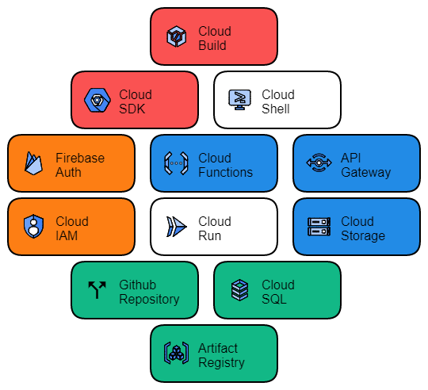
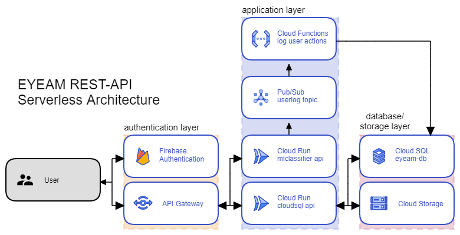
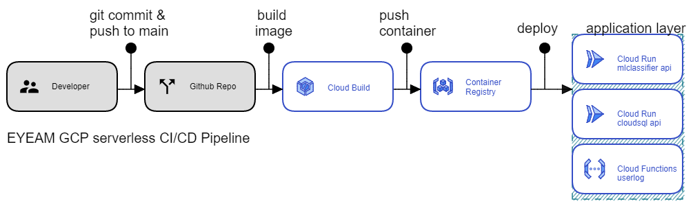

# EYEAM Cloud Computing Repository
A Repository for Cloud Computing part of EYEAM-Bangkit Project

- Muhammad Ilham Hanifan (C2009F0984)
- Iqbal Khariza (C2009F0920)

## Services Used

  

## Serverless Architecture

  

We use built a serverless architecture using services listed below:
- API Gateway = Manage endpoints and provide authentication for users
- Firebase Authentication = Manage user accounts and provide token generation for authentication
- Cloud Pub Sub = Provide Communication between `mlclassifier-run` and `loguser-function` 
- Cloud Run = Hosts ML model in `mlclassifier-run` and access to cloud SQL in `cloudsql-run` as docker containers  
- Cloud Functions = Contains the code to log user actions, triggered by a topic published from `mlclassifier`
- Cloud SQL = Stores animal details and user logs
- Cloud Storage = Stores animal images, models, and .APK

## Continuous Deployment

  

 

We create a continuous deployment workflow using Github Repo and Cloud Build. Everytime a commit is pushed to main branch Cloud Build will run the script called `cloudbuild.yaml`. This script will Build a new image from `mlclassifier-run, cloudsql-run, loguser-functions` folders, Push them to container registry, and then deploy them to Cloud Run and Cloud Functions.

We built a CI/CD pipeline using Google Cloud Platform Services listed below:
- Cloud Build = Building, Push, and deploying images from git repository using `cloudbuild.yaml` script
- Container Registry = Stores newly generated container images from cloud build
- Github Repository = Source code repository
