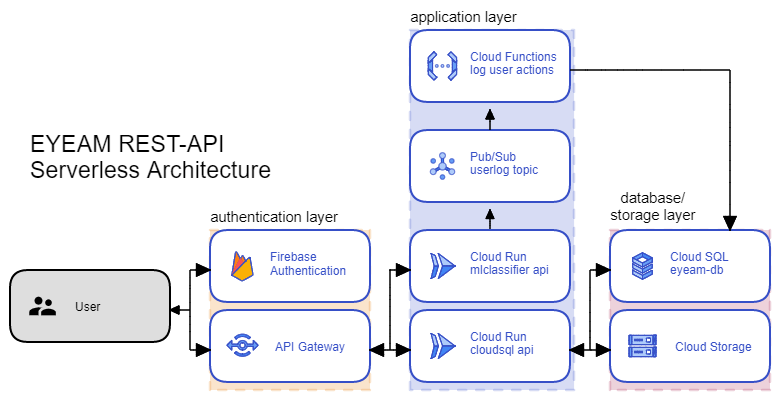

# Cloud-Computing
CC part of EYEAM project.

## Continuous Deployment

We create a continuous deployment workflow using Github Repo and Cloud Build. Everytime a commit is pushed to main branch Cloud Build will run the script called `cloudbuild.yaml`. This script will Build a new image from `mlclassifier-run, cloudsql-run, loguser-functions` folders, Push them to container registry, and then deploy them to Cloud Run and Cloud Functions.

We built a CI/CD pipeline using Google Cloud Platform Services listed below:
- Cloud Build
- Container Registry
- Github Repository

## Serverless Architecture

We use built a serverless architecture using services listed below:
- API Gateway
- Firebase Authentication
- Cloud Pub Sub
- Cloud Run
- Cloud Functions
- Cloud SQL
- Cloud Storage

